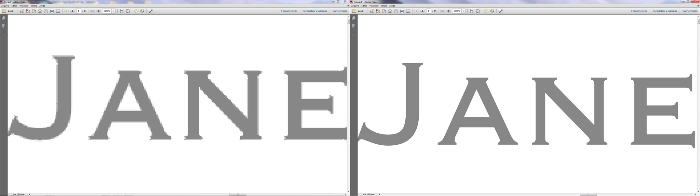
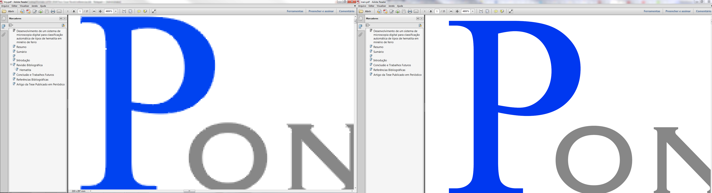
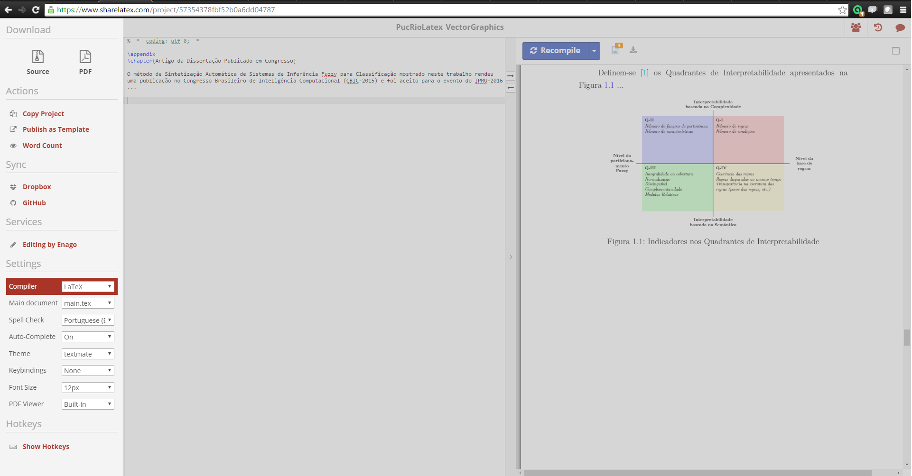
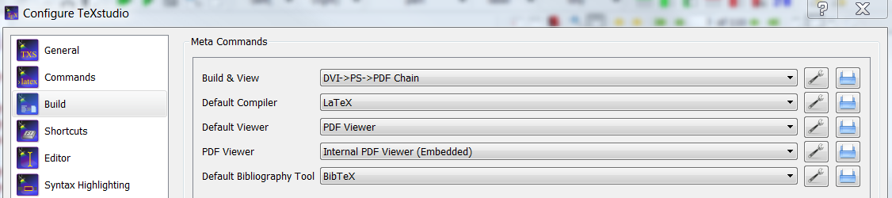
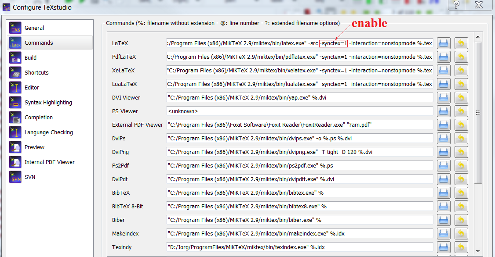
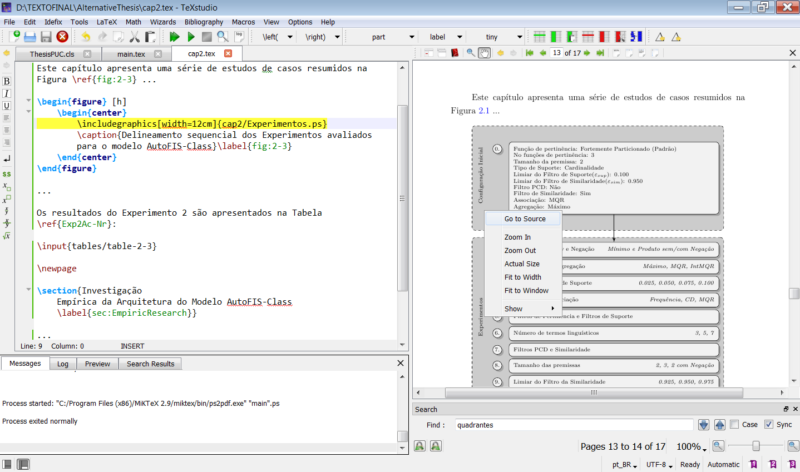

This repository is an alternative to compile vector images (.eps, .ps) in the [PUC-RIO template latex](http://www.puc-rio.br/ensinopesq/ccpg/apresentacao_ted.html). **However, images as png, jpeg, jpg can not be compiled**.

The Bibtex bibliography style is the same of the original template, take care using the key parameter.

The main objectives are:
- Improve quality in our images.
  
  
- Reduce size of document output.

Also, it is provided the use of square brackets in citations. In order to generate the pdf file using vector images, we can do in 3 ways:

# 1. ShareLatex
The [source files](https://github.com/warderm6/PucRioLatex_VectorGraphics/tree/master/sourceFiles) can be upload to [ShareLatex](https://www.sharelatex.com/). Only one condition must be fulfilled: set the compiler in LaTex mode, not pdfLaTeX.


# 2. From an IDE as TeXstudio
## 2.1 Build & View
Go to **Options/Configure TeXstudio/Build** and set the commands as is shown in the next figure.


## 2.2 Enable Go to Source
An important tip to map the output (pdf file) with the source (latex files) is *"Go to Source"*. To enable this feature, go to **Options/Configure TeXstudio/Commands**:




# 3. From command line

According to the LaTeX compilation file flow:


We have to use:

```
latex main.tex
bibtex main.aux
latex main.tex
```

To transform the dvi file generated to pdf file:
```
dvips main.dvi : converts a DVI file to PostScript
ps2pdf test1.ps : converts a PostScript file to PDF
```
